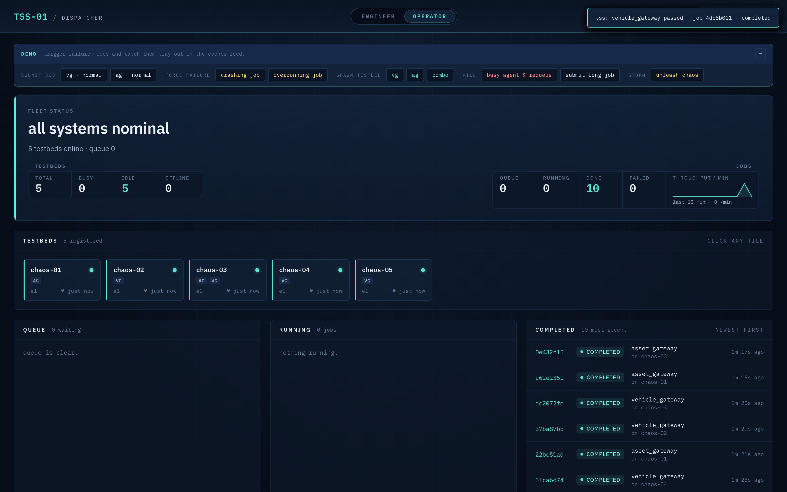
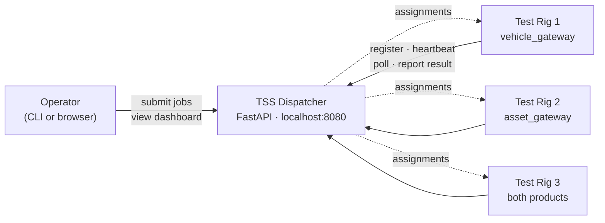

# Samsara TSS — Test Scheduling Service

A Test Scheduling Service for Hardware-in-the-Loop (HIL) firmware validation. Manages a fleet of "testbeds" with automatic capability-aware routing, heartbeat-based resiliency, and a live web dashboard.

Built as the Samsara Automation Team's Build-with-AI assessment.



## What it does

1. **Registration & Capability** — Testbeds check in and declare which products they support (`vehicle_gateway`, `asset_gateway`).
2. **Intelligent Routing** — Jobs are submitted with a required product. The dispatcher atomically claims the next compatible job for an agent that polls.
3. **Resiliency** — A heartbeat watchdog detects testbeds that go silent (≥ 3 missed heartbeats) and re-queues their in-flight jobs to other compatible agents. Late results from a previously-offline agent are rejected via an epoch invariant.
4. **Persistence** — All jobs and their full event history survive dispatcher restarts. SQLite-backed store (stdlib `sqlite3`, WAL mode) with an explicit `update(job)` contract at every mutation site. `--db-path` flag and `TSS_DB_PATH` env var control the file; `:memory:` keeps tests fast.
5. **Customer Visibility** — Every job carries a `submitter` (and optional `branch` / `commit`) field. The dashboard ships in two role-scoped views toggled in the topbar: an **engineer view** that centers on a single "my build" hero with a journey track, and an **operator view** with fleet health, throughput sparkline, and the full queue → running → completed lifecycle as a 3-column row. Both views share slide-over panels for job and agent detail (full attempt timeline + plain-English "what TSS did" prose). The operator view also includes an inline **demo strip** that triggers each failure mode on demand. `/metrics` exposes fleet counts in Prometheus text format.

## Architecture (one-minute version)

Three roles, one box.



Three things to know up front:

- **Rigs poll, the dispatcher doesn't push.** Polling is robust to flaky HIL networks.
- **One Python process, one queue, one `asyncio.Lock` around all writes.** Per-resource locks would be more code and not measurably faster at this scale.
- **SQLite is the durable store.** Jobs and event history survive restarts. Tests use `:memory:` mode so there's no file I/O overhead.

The full story — tech stack, dispatcher internals, data model, sequence diagrams, job state machine, and where to look first — lives in **[`docs/architecture.md`](docs/architecture.md)**. The hand-drawn Excalidraw renders for the live demo are in `docs/diagrams.md`.

## Quick start

```bash
# 1. Install (uses uv; Python 3.11+ required)
make install

# 2. Run the demo (requires tmux)
make demo

# Or, without tmux:
make demo-plain
```

`make demo` opens a tmux session with the dispatcher, 5 mock agents (vg-01, vg-02, ag-01, ag-02, combo-01), and an operator REPL. The dashboard is at <http://localhost:8080/>.

To exercise it:

```bash
# In a separate terminal (or the operator pane):
tss submit-job --product vehicle_gateway --duration 8 --submitter you
tss submit-job --product asset_gateway --duration 12 --submitter you

# Watch the dashboard tiles change. Click "kill (demo)" on a tile to simulate
# an agent disconnect and watch reassignment in real time.

tss agents       # rich table of fleet status
tss jobs         # rich table of jobs
```

## Chaos demo

The mock agent supports four failure modes via a chaos profile:

- `silent_death` — agent stops sending heartbeats entirely.
- `partition` — agent skips heartbeats for a stretch (network partition).
- `job_crash` — agent reports a job as failed at a random progress point.
- `slow_exec` — agent overruns the declared duration (caught by the per-job overrun watchdog).

The fastest way to see all four: run the dispatcher (`tss serve`), open the dashboard, switch to the operator view, and click **`unleash chaos`** in the demo strip. That spawns 8 mixed-profile local agents (stable × 2, flaky × 2, crashy × 2, doomed × 2) and starts a server-side job-drip task that submits a job every 1.2–2.8s. Click the same button again to stop.

The same demo strip also includes one-click triggers for individual failure modes:

- **submit job** — vg / ag normal jobs.
- **force failure** — `crashing job` (non-zero exit, retries through `max_attempts`) or `overrunning job` (slow_multiplier 5×, watchdog kills at 3× declared duration).
- **spawn testbed** — vg / ag / combo agents (combo = supports both products).
- **kill** — kill a busy agent (prefers busy so you reliably see the requeue + reassignment) or submit a 30s long job to ensure something is running before killing.
- Each offline testbed tile gets a **`↻ revive`** button that clears the kill quarantine and lets the agent re-register on its next backoff retry — the epoch ticks up so you can demonstrate the invariant on stage.

Equivalent CLI workflow:

```bash
# Spawn 10 agents with a mix of profiles
tss chaos --count 10 --intensity mixed

# Then submit 30 jobs and watch the dashboard
for i in $(seq 1 15); do tss submit-job --product vehicle_gateway --duration 8; done
for i in $(seq 1 15); do tss submit-job --product asset_gateway --duration 8; done
```

Every job reaches a terminal state, even with agents dying mid-run. This is verified by the chaos integration test (`pytest -m chaos`).

## Project layout

```
tss/
  common/        # Pydantic models, constants, fake-clockable time wrapper
  server/        # FastAPI app, dispatcher (single asyncio.Lock), watchdog
    routes/      # /api/agents, /api/jobs, /api/fleet/status, /metrics, /api/demo
    static/      # dashboard HTML/CSS/JS — engineer + operator views, slide-overs,
                 #   demo strip; plain ES2020+, no build step
    sqlite_store.py   # SQLiteJobStore — the canonical job store
    store.py          # JobStore protocol
  agent/         # Mock agent runner + chaos profiles
  cli.py         # Typer CLI: serve, agent, chaos, submit-job, agents, jobs
tests/
  unit/          # dispatcher, registry, sqlite_store, chaos profile sampling, persistence
  integration/   # full HTTP flow, capability matching, reassignment, stale agent,
                 #   concurrent claim, per-job overrun, submitter filter, mine filter,
                 #   job detail, metrics, agent history, branch/commit propagation,
                 #   throughput sparkline series, epoch history, chaos
```

The critical correctness lives in `tss/server/dispatcher.py` (one `asyncio.Lock`, all mutations behind it) and `tss/server/watchdog.py` (the async loop that calls `reap_stale_agents`).

## Testing

```bash
make test            # everything including the long chaos test (~5s)
make test-fast       # skip the chaos test
make test-chaos      # only the chaos test
make lint            # ruff
make typecheck       # mypy --strict
```

The three race-condition tests are non-negotiable:

- `tests/integration/test_concurrent_claim.py` — N agents poll simultaneously, exactly one wins.
- `tests/integration/test_stale_agent.py` — late result from an offlined agent returns 409, doesn't clobber the new agent's result.
- `tests/integration/test_per_job_overrun.py` — an agent that heartbeats but never finishes is force-requeued.

## API reference

OpenAPI docs are auto-generated at `/docs` (Swagger UI) and `/redoc`.

### Agents

**`POST /api/agents/register`** — Register or re-register a testbed. Safe to call repeatedly; increments the agent's epoch on each call so stale in-flight results from a previous incarnation are rejected.

```jsonc
// request
{ "name": "vg-01", "capabilities": ["vehicle_gateway"] }

// response 200
{ "agent_id": "<uuid>", "epoch": 1, "heartbeat_interval_s": 2.0, "poll_interval_s": 1.0 }
```

**`POST /api/agents/{agent_id}/heartbeat`** — Keep-alive from an agent. Must echo the current `epoch`.

```jsonc
// request
{ "epoch": 1 }
// 204 accepted  |  410 Gone → agent was pruned, must re-register
```

**`GET /api/agents/{agent_id}/jobs/next`** — Atomic job claim. The dispatcher matches the agent's capabilities against the queued jobs and assigns the oldest compatible one in a single lock step.

```jsonc
// 200 — job assigned
{
  "job_id": "<uuid>", "product": "vehicle_gateway",
  "duration_seconds": 8.0, "expected_exit_code": 0,
  "crash_at_pct": null, "slow_multiplier": 1.0, "epoch": 1
}
// 204 — no compatible job waiting
// 409 — agent is already running a job
// 410 — agent unknown, must re-register
```

**`POST /api/agents/{agent_id}/jobs/{job_id}/result`** — Report a job outcome. The `epoch` must match what was in the assignment; a mismatch means the agent was considered offline and a new agent already owns the job.

```jsonc
// request
{ "epoch": 1, "exit_code": 0, "duration_actual": 7.4, "error_message": null }
// 204 accepted  |  409 stale/wrong owner  |  410 unknown agent  |  404 unknown job
```

**`GET /api/agents`** — List all registered agents with their current status (`idle`, `busy`, `offline`). Each agent record includes `epoch_history` (a capped list of past `EpochSummary` objects) and per-current-epoch `jobs_claimed` / `jobs_completed` / `jobs_failed` counters.

**`GET /api/agents/{agent_id}/history`** — Events filtered to one agent, newest first. Powers the agent slide-over panel's "recent events on this testbed" list. Each entry includes `at`, `kind`, `job_id`, `product`, and `detail`.

**`POST /api/agents/{agent_id}/kill`** — Demo only. Simulates an immediate disconnect so you can watch job reassignment on the dashboard. Marks the agent OFFLINE, requeues its current job, bumps the epoch, and adds the agent's *name* to a 30-second kill-quarantine so the runner cannot immediately re-register. Returns 204.

```jsonc
// 204 No Content                       ← accepted; quarantine begins
// 423 Locked on subsequent register    ← runner backs off until the deadline
// 404                                  ← unknown agent
```

---

### Jobs

**`POST /api/jobs`** — Submit a test job. Only `product` and `duration_seconds` are required.

```jsonc
// request
{
  "product": "vehicle_gateway",   // required — must match an agent capability
  "duration_seconds": 8.0,        // required
  "submitter": "alice",           // optional, defaults to "unknown"
  "branch":    "alice/can-bus",   // optional — shown on the engineer-view "my build" hero
  "commit":    "4e9f1c7",         // optional — shown next to branch
  "expected_exit_code": 0,        // optional
  "crash_at_pct": null,           // optional 0.0–1.0 — agent will fail at this fraction
  "slow_multiplier": 1.0,         // optional ≥0.1 — agent runs N× declared duration
  "max_attempts": 3               // optional, 1–10; how many times to retry on agent failure
}

// response 201
{ "job_id": "<uuid>" }
```

**`GET /api/jobs`** — List all jobs. Supports query-string filters:

| Parameter | Values | Effect |
|---|---|---|
| `status_filter` | `queued`, `running`, `completed`, `failed` | Return only jobs in this state |
| `product` | any string | Return only jobs for this product |
| `submitter` | any string | Return only jobs from this submitter |

**`GET /api/jobs/{job_id}`** — Full job record including `history` (the ordered list of `JobEvent` objects that records every state transition: submitted, claimed, reassigned, completed, etc.).

---

### Fleet and metrics

**`GET /api/fleet/status`** — Dashboard snapshot. Returns:

- `agents` — full agent records (with `epoch_history` and per-epoch counters)
- `queue` — every queued job
- `running_jobs` — every running job
- `recent_completed` — last 20 terminal jobs (newest first), used by the operator-view "completed" column
- `recent_events` — flattened cross-job event stream (capped at 100), each row carries `submitter` + `agent_id` + `agent_name` for click-through
- `stats` — aggregate counts plus `throughput_per_min`: a 12-element list of jobs-completed-per-minute (oldest first), sourced from a per-dispatcher monotonic ring buffer. Drives the operator hero's sparkline.

**`GET /metrics`** — Prometheus text format. Exposes `tss_agents_total{status}` and `tss_jobs_total{status}` gauges. No extra dependencies required.

**`GET /`** — Live dashboard HTML.

---

### Demo-only routes

These are scoped under `/api/demo` and orchestrate local agent subprocesses for live demos. They should never be exposed beyond localhost.

**`POST /api/demo/agents/spawn`** — Launch a `tss agent` subprocess that registers with this dispatcher.

```jsonc
// request
{ "name": "vg-extra", "capabilities": ["vehicle_gateway"], "profile": "stable" }
// response 201
{ "name": "vg-extra", "pid": 12345, "capabilities": ["vehicle_gateway"] }
```

**`POST /api/demo/agents/{agent_id}/revive`** — Clear an agent's kill-quarantine so the runner's next backoff retry succeeds. The dashboard's per-tile `↻ revive` button uses this. Returns 204.

**`POST /api/demo/chaos-storm/start`** — Spawn 8 mixed-profile agents (`stable / flaky / crashy / doomed`, two each) and start an asyncio drip task that submits a random job every 1.2–2.8s. Exercises every failure mode the brief calls out: silent_death, partition, job_crash, slow_exec.

```jsonc
// response 200
{ "running": true, "spawned": ["storm-00", "storm-01", ...] }
// 409 if a storm is already running
```

**`POST /api/demo/chaos-storm/stop`** — Cancel the drip task and SIGTERM the spawned subprocesses. Idempotent.

**`GET /api/demo/chaos-storm`** — Current state (running, list of spawned names) so the dashboard can sync the toggle button on reload.

## Configuration

All tunables are env-vars (with defaults shown):

| Variable | Default | Meaning |
|---|---|---|
| `TSS_HOST` | `127.0.0.1` | Dispatcher bind host. |
| `TSS_PORT` | `8080` | Dispatcher bind port. |
| `TSS_DB_PATH` | `./tss.db` | SQLite database path. Pass `:memory:` for an ephemeral in-memory instance. Overridden by `--db-path` CLI flag. |
| `TSS_HEARTBEAT_INTERVAL_S` | `2.0` | Agent heartbeat cadence. |
| `TSS_HEARTBEAT_TIMEOUT_S` | `6.0` | Mark agent OFFLINE after this many seconds without a heartbeat. |
| `TSS_WATCHDOG_INTERVAL_S` | `1.0` | How often the watchdog scans the registry. |
| `TSS_POLL_INTERVAL_S` | `1.0` | Agent's job-poll cadence. |
| `TSS_JOB_MAX_ATTEMPTS` | `3` | Default reassignment budget per job. |
| `TSS_MAX_OVERRUN_FACTOR` | `3.0` | A running job exceeding `duration × this` is force-requeued. |

In-process constants (in `tss/server/dispatcher.py`, not yet env-var-driven):

| Constant | Default | Meaning |
|---|---|---|
| `KILL_QUARANTINE_S` | `30.0` | How long an operator-killed agent name is barred from re-registering. Long enough for the audience to see the offline state and the resulting reassignment without permanently retiring the agent. |
| `EPOCH_HISTORY_CAP` | `50` | Per-agent cap on retained past-epoch summaries. Older epochs are dropped so a flapping chaos agent doesn't grow the registry without bound. |
| `THROUGHPUT_BUCKETS` | `12` | Length of the jobs-per-minute series surfaced in `FleetStats.throughput_per_min`. |

## How AI was used

See `docs/ai-log.md` for the prompts and the places the LLM's first draft missed something. Short version:

* AI scaffolded models, FastAPI routes, dashboard HTML/CSS, CLI structure, and the first cut of every test.
* Hand-written: the lock semantics in `dispatcher.py`, the epoch invariant, the per-job overrun branch in the watchdog. These are the parts the assessment grades on, and an LLM's first draft missed each one.
* The dispatcher state machine is deterministic; the test suite is the source of truth, not the prompt.

## Scaling beyond 10 agents

Sketched in `docs/scale-evolution.md`. The SQLite store is already step 1. The remaining path: swap `InMemoryAgentRegistry` and `SQLiteJobStore` for Postgres + Redis, partition by capability/region using NATS or Kafka, and run stateless dispatcher replicas behind a load balancer with a Postgres-advisory-lock leader for the watchdog. The `JobStore` Protocol is the seam — no route or agent changes required.
