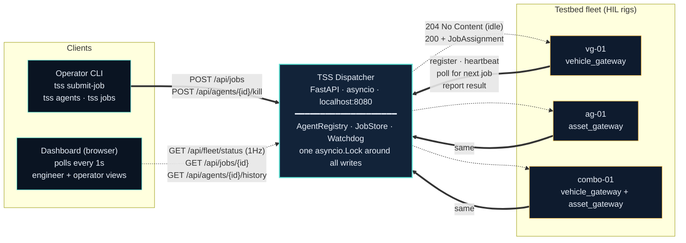
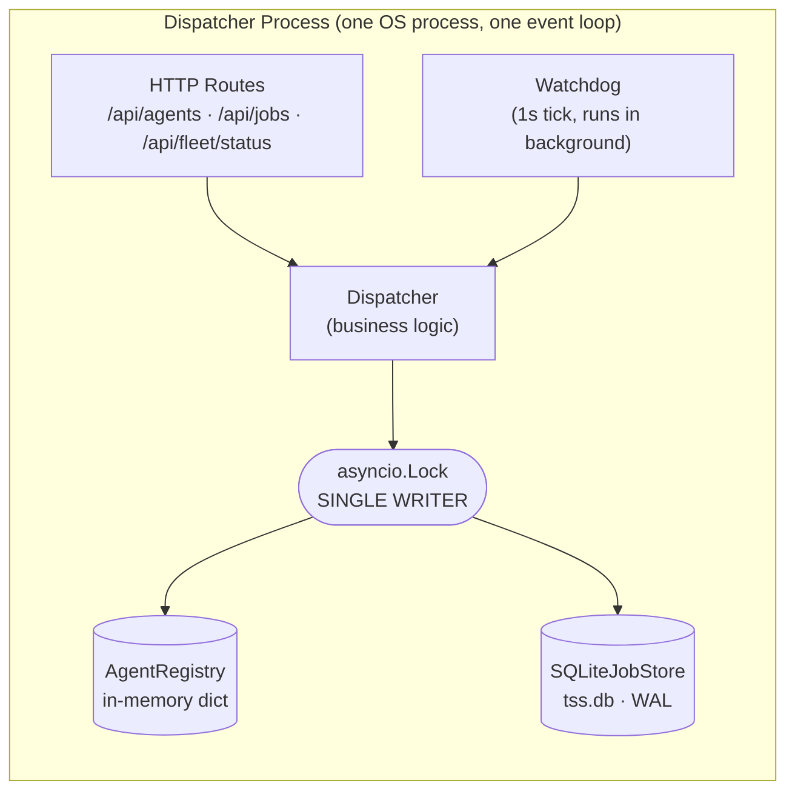
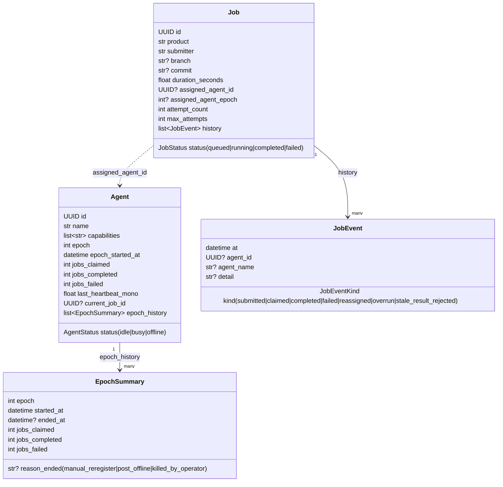
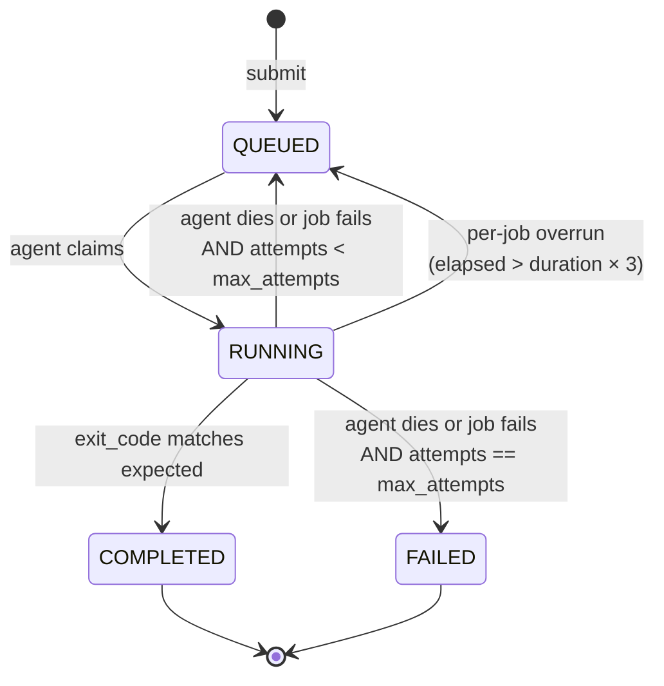
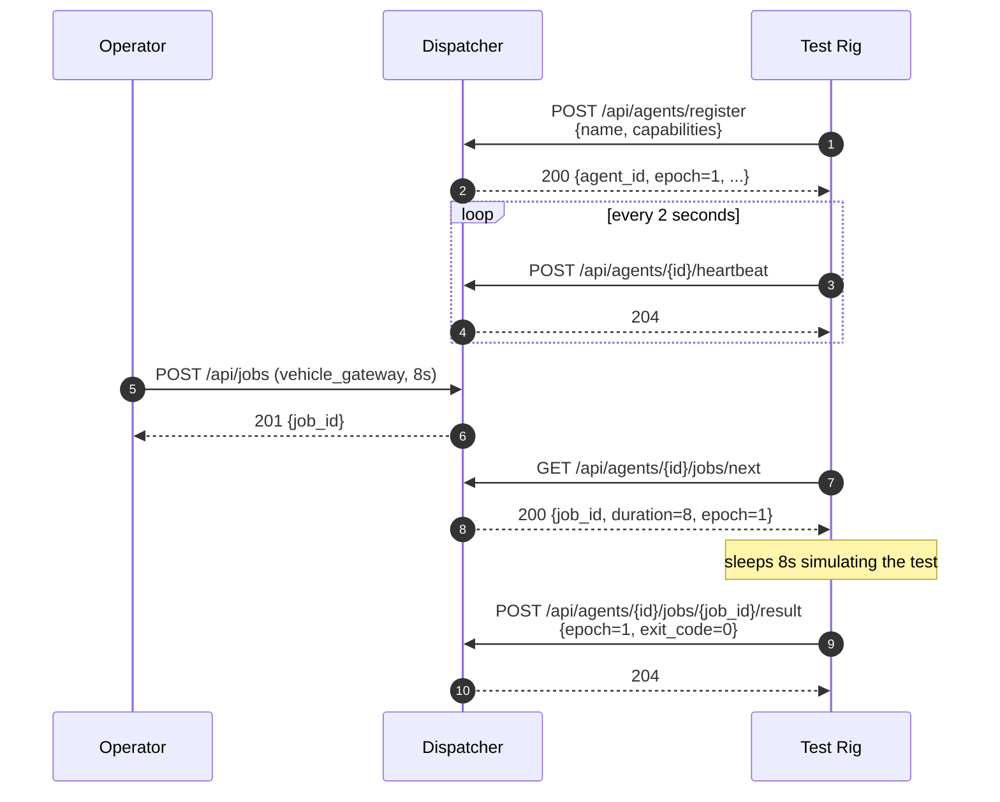
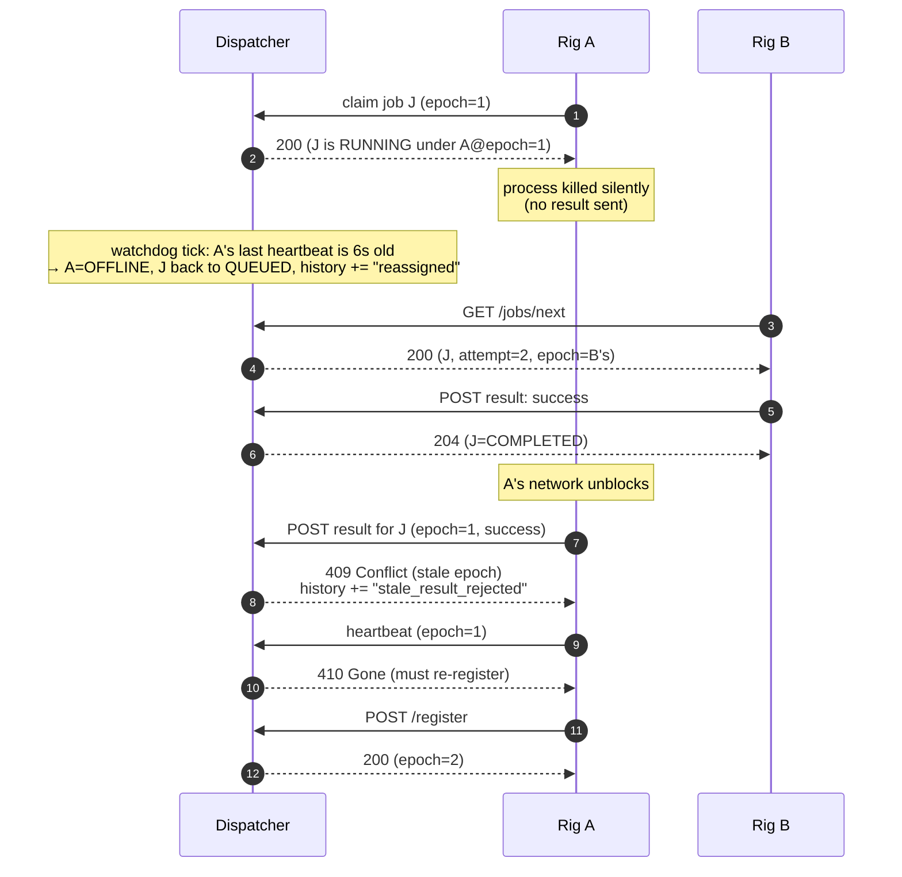

# Architecture

This is the deep-dive companion to the README. It explains, in plain English, what's in the codebase and why it's built this way.

If you're reading this to prep for the presentation, the short version: **one Python process, one queue, one lock around all writes, one background loop that reaps dead test rigs.** Everything else is detail.

---

## What the service does, in one sentence

Operators submit firmware test jobs, each tagged with a required product (e.g. `vehicle_gateway`). The dispatcher routes each job to a compatible, alive, idle test rig — and if a rig dies mid-test, the dispatcher detects that and re-runs the job somewhere else.

---

## Tech stack

| Layer | Choice | Why |
|---|---|---|
| Language | Python 3.11+ | Fastest scaffold, lets time go to chaos demo and tests rather than boilerplate. |
| Web framework | FastAPI | Async-native, gives free OpenAPI docs at `/docs`, low ceremony. |
| ASGI server | Uvicorn | Standard pairing with FastAPI. |
| Data validation | Pydantic v2 | All wire types are typed; validation happens at the HTTP boundary, not in business logic. |
| Concurrency | `asyncio` (single process) | One event loop, one `asyncio.Lock`. No threads, no multiprocessing. |
| HTTP client (agents) | `httpx` (async) | Mirrors the server stack so we don't mix sync/async. |
| CLI | Typer + Rich | Typer for the command tree, Rich for nicely formatted tables (`tss agents`, `tss jobs`). |
| Dashboard | Plain HTML + CSS + vanilla JS (ES2020+) | No build step, no JS deps. Two role-scoped views (engineer / operator) toggled in the topbar; slide-over panels for job and agent detail; an inline "demo strip" at the top of the operator view that triggers each failure mode on demand. Polls `/api/fleet/status` once a second. Lives in `tss/server/static/`. |
| Storage | SQLite (stdlib `sqlite3`, WAL mode) via `SQLiteJobStore`; `InMemoryAgentRegistry` for agents | Jobs and their full event history survive restarts. `:memory:` mode in tests for zero I/O overhead. Swappable for Postgres at scale via the `JobStore` Protocol. |
| Tests | pytest + pytest-asyncio + Hypothesis | The race-condition tests are integration-flavored; Hypothesis is used for property-based fuzzing of the dispatcher state machine. |
| Linters | ruff (lint + format), mypy --strict | Strict typing required for `tss/`. |
| Packaging | uv + hatchling | `uv sync --extra dev` for a one-step install. |
| Demo runner | Make + tmux | `make demo` opens a tmux session with dispatcher + 5 mock rigs + an operator REPL. The operator dashboard also embeds a one-click chaos-storm trigger that spawns local agent subprocesses with mixed failure profiles. |

---

## High-level picture (system diagram)

This is the block diagram for the presentation: **how the service interacts with agents, how operators submit work, and how the dashboard visualizes fleet status** — all three paths on one canvas.



Read it in three layers:

- **Solid arrows = writes.** Operators submit jobs and trigger demo actions; agents register, heartbeat, claim, and report. Every one of these crosses the single `asyncio.Lock` at the dispatcher.
- **Dashed arrows = reads.** The dashboard polls `/api/fleet/status` once per second to repaint; clicking a job or agent fetches detail. The dispatcher's responses to agent polls (the assignment payloads) are also reads from the agent's perspective — the dispatcher *never pushes* work.
- **Subgraphs = trust zones.** Clients on the left, the single-process dispatcher in the middle, the HIL fleet on the right. Everything between zones is HTTP, no WebSockets, no message queue, no shared filesystem.

Three things to notice:

- **The dispatcher does not push work to rigs.** Rigs poll every second asking "any work for me?" Polling is more robust than push to flaky HIL networks, and it folds liveness into the same channel as work delivery.
- **The dashboard is just another HTTP client.** It has no privileged backchannel — everything it shows is reachable from `curl /api/fleet/status`. That keeps the trust boundary clean and the visibility surface fully API-first.
- **One process holds all state.** The dispatcher's lock is the only critical section. Postgres + a stateless dispatcher fleet is the scale-out story (see `scale-evolution.md`); the seam is the `JobStore` Protocol.

---

## Inside the dispatcher

When an HTTP request lands at the dispatcher, this is what happens internally.



The shapes matter:

- **Pill (`Lock`)** — the single point of mutual exclusion. Every state change in the system passes through this gate.
- **Cylinder (`AgentRegistry`, `SQLiteJobStore`)** — storage. The job store is SQLite-backed today; tomorrow it's Postgres behind the same `JobStore` Protocol.
- **Box (`Watchdog`)** — a background loop that wakes up every second and asks the dispatcher to scan for dead rigs and stuck jobs. It does not have its own lock; it borrows the dispatcher's.

**Why one lock?** With ~10 rigs, contention is invisible — the lock is held for microseconds. Per-resource locks introduce ordering bugs (lock A then B vs lock B then A → deadlock) for no measured benefit. If we ever scaled past the point where this matters, we'd swap to Postgres row-level locks, not split this one.

---

## Data model

Three Pydantic models do most of the work. Source: `tss/common/models.py`.



A few fields earn their keep:

- `Agent.epoch` — incremented every time an agent (re-)registers. The "version number" we stamp on every job claim.
- `Agent.epoch_history` — the dashboard's agent slide-over renders these as bands so a reviewer can *see* that each (re-)registration is its own window with a reason for ending. Capped at `EPOCH_HISTORY_CAP=50`.
- `Agent.jobs_claimed/completed/failed` — per-current-epoch counters; reset on re-registration. The previous epoch's totals are captured into the appended `EpochSummary` first.
- `Job.assigned_agent_epoch` — captured at claim time. Used to reject late results from a previous incarnation of the agent.
- `Job.branch / Job.commit` — optional metadata an operator can attach to a submission; the engineer-view "my build" hero shows them next to the status pill so a firmware engineer can see at a glance which branch is on which testbed.
- `Job.history` — every transition is appended here as a `JobEvent`. The dashboard's "Recent events" panel is built from this list. Cheap to add; it's the visibility surface for resiliency.

---

## Job lifecycle (state machine)



Three things can move a job out of RUNNING:

1. **Agent reports a result** — success → COMPLETED, failure → QUEUED or FAILED.
2. **Agent goes silent** — watchdog detects missed heartbeats → job back to QUEUED.
3. **Job runs too long** — watchdog detects elapsed > 3× declared duration → job back to QUEUED, agent freed even if it was still heartbeating.

The third case is the "stuck-but-alive" failure mode. AI's first draft of the watchdog only handled the first two.

---

## Happy-path sequence



---

## Failure-path sequence (the one the assessment is graded on)

This is the sequence that makes the epoch invariant earn its keep.



Without the epoch check, step 11 would overwrite step 9's correct result with A's stale outcome. With it, A's late result is detected and dropped.

---

## Concurrency model: one lock, one critical section

The single most important rule in this codebase:

> **Every mutation of `AgentRegistry` and `JobStore` happens inside `async with dispatcher._lock:`**

That includes:

| Operation | Method | Why it needs the lock |
|---|---|---|
| Register / re-register an agent | `register` | Bumps epoch, captures previous epoch into `epoch_history`, resets per-epoch counters, replaces agent record. Rejects with `AgentQuarantinedError` if the name is in a kill quarantine. |
| Heartbeat | `heartbeat` | Writes timestamps; checks epoch. |
| Submit a job | `submit_job` | Adds to the store. |
| Claim a job | `claim_next_job` | Find-and-assign must be atomic. |
| Report a result | `report_result` | Multi-field state machine transition. Bumps the agent's per-epoch counters and the throughput ring buffer. |
| Watchdog tick | `reap_stale_agents` | Scans both registry and store, mutates both. |
| Force-kill (demo button) | `force_kill_agent` | Marks offline, requeues current job, bumps epoch, sets a per-name `KILL_QUARANTINE_S` deadline so the agent runner cannot immediately re-register and erase the visible offline state. |

The lock is held only for the duration of a state change — microseconds. **Nothing awaits anything other than the lock itself inside a critical section.** This keeps lock-hold time bounded and rules out lock-order inversions.

Two failure modes the lock prevents:

1. **Two agents claiming the same job** — without the lock, both could read `job.status == QUEUED`, both write `RUNNING`, and the dispatcher would believe two rigs are working on the same job. Test: `tests/integration/test_concurrent_claim.py`.
2. **Watchdog requeues while a result is being reported** — without the lock, the watchdog could re-queue a job at the same instant the agent is reporting completion, leading to duplicated work or lost results.

---

## What the watchdog does, exactly

`tss/server/watchdog.py` is just a loop. The actual work happens in `Dispatcher.reap_stale_agents` (under the lock).

Each tick (default 1 second):

1. For every agent: if `now - last_heartbeat > 6s`, mark it OFFLINE. If it had a job, push that job back to QUEUED and emit a `reassigned` event (or `failed` if attempts are exhausted).
2. For every RUNNING job: if `elapsed > duration × 3`, push it back to QUEUED (overrun) and free the owning agent.

That's the entire resiliency story.

---

## Demo affordances (operator dashboard)

The operator-view dashboard is also the live-demo surface. It includes a small set of "demo only" routes (under `/api/demo`) that orchestrate local agent subprocesses so a presenter can drive the entire failure-mode story without leaving the browser.

| Route | Purpose |
|---|---|
| `POST /api/demo/agents/spawn` | Launch a local `tss agent` subprocess that registers with this dispatcher. Caller picks name, capabilities, and chaos profile. PIDs are tracked on `app.state.demo_pids`. |
| `POST /api/demo/agents/spawn-random` | Convenience — random capabilities, stable profile. |
| `POST /api/demo/agents/{id}/revive` | Clear an agent's kill quarantine so the runner's next register attempt succeeds. The dashboard's per-tile `↻ revive` button calls this. |
| `POST /api/demo/chaos-storm/start` | Spawn 8 mixed-profile agents (stable / flaky / crashy / doomed × 2 each) and start an asyncio drip task that submits jobs every 1.2–2.8s. Exercises every failure mode the assessment calls out. |
| `POST /api/demo/chaos-storm/stop` | Cancel the drip task and SIGTERM the spawned subprocesses. Idempotent. |
| `GET /api/demo/chaos-storm` | Status (running, list of spawned names) so the dashboard can sync the toggle button after a reload. |

The kill quarantine + 423 backoff is what makes the kill demo legible: without it, the agent's runner re-registers within a heartbeat cycle and the tile flips back to green before the watchdog has logged the reassignment. With it, the killed tile stays red for `KILL_QUARANTINE_S=30` seconds (or until the user clicks `↻ revive`), giving the audience time to see the reassigned job claimed by another testbed and the epoch tick on revive.

These routes are scoped under `/api/demo` so the path itself is the trust boundary — they should never be exposed beyond localhost.

---

## Project layout

```
tss/
├── common/
│   ├── clock.py        # monotonic() + utcnow() — fakeable in tests
│   ├── constants.py    # tunables (heartbeat interval, timeout, etc.)
│   └── models.py       # Pydantic v2 models (Agent, Job, JobEvent, ...)
├── server/
│   ├── app.py          # FastAPI app factory, lifespan starts/stops watchdog
│   ├── dispatcher.py   # *** correctness lives here — one asyncio.Lock ***
│   ├── watchdog.py     # background loop that calls reap_stale_agents
│   ├── registry.py     # AgentRegistry interface + InMemory impl
│   ├── store.py        # JobStore Protocol (interface only)
│   ├── sqlite_store.py # SQLiteJobStore — canonical impl (stdlib sqlite3, WAL)
│   ├── errors.py       # typed exceptions mapped to HTTP status codes
│   ├── routes/         # HTTP routes — thin shells over the dispatcher
│   │   ├── agents.py   # /api/agents — register/heartbeat/kill, list, /{id}/history
│   │   ├── jobs.py     # /api/jobs — submit/list/get; submitter + status + product filters
│   │   ├── fleet.py    # /api/fleet/status — dashboard snapshot
│   │   ├── metrics.py  # /metrics — Prometheus text format, zero deps
│   │   └── demo.py     # /api/demo — spawn agent subprocesses, revive killed agents,
│   │                   #            chaos-storm start/stop. Demo-only, never expose
│   │                   #            beyond localhost.
│   └── static/         # dashboard HTML/CSS/JS — engineer + operator views, slide-overs,
│                       # demo strip, all in plain ES2020+ (no build step)
├── agent/
│   ├── runner.py       # mock agent — register, heartbeat, poll, report
│   └── chaos.py        # failure profiles for the chaos demo
└── cli.py              # Typer CLI: serve (--db-path), agent, chaos, submit-job (--submitter), agents, jobs

tests/
├── unit/               # dispatcher, registry, sqlite_store, chaos profile sampling
└── integration/        # full HTTP flow + race tests + submitter filter +
                        #   job detail + metrics + chaos
```

---

## Where to look first if you're new to the codebase

In this order:

1. `tss/common/models.py` — the data shapes. 5 minutes.
2. `tss/server/dispatcher.py` — the brain. All logic, all locking. 20 minutes.
3. `tests/integration/test_stale_agent.py` — the headline race test. Reading this teaches you the epoch invariant faster than any prose. 5 minutes.
4. `tss/server/watchdog.py` — 60 lines, mostly cancellation handling.
5. `tss/agent/runner.py` — what a mock test rig actually does.

Skip the routes, the dashboard JS, and the CLI on a first pass. They're scaffolding.
